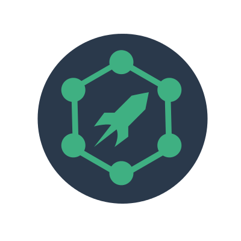

# GraphQL Rover

<p align="center">
  
</p>

<p align="center">
  
  
  
</p>


  
## Intro
**GraphQL Rover** is a [GraphQL](http://graphql.org/) schema viewer.

Generate a navigable representation of the underlying schema through the [introspection](http://graphql.org/learn/introspection/) query, displaying nodes as [Vue.js](https://vuejs.org/) components using [D3.js](https://d3js.org/) to build the graph.

Check the [Demo](https://brbb.github.io/graphql-rover/) based on the _GraphQL Pokemon API_, allow `HTTP` scripts execution or change the endpoint from the side panel.

## Quick start
Description + video

1. Setup the endpoint


2. Re-arrange nodes


3. Select to zoom and inspect a type or use the search bar


## Run
#### Option 1:
`git clone` the [repo](https://github.com/Brbb/graphql-rover.git) anywhere, run locally `path-to-graphql-rover/graphql-rover/index.html` and follow the quickstart steps. There's no need to keep Rover in the same path of your database, or on a server.

#### Option 2:
Run as Electron app and follow the quickstart steps:
``` shell
$ cd graphql-rover/
$ electron .
```
#### Option 3
Run the GraphQL Rover.app (OSX electron package only)

## Features
- [x] Drag nodes
- [x] Pan & Zoom
- [x] Zoom on selection
- [x] Navigate clicking on Type-links inside the node or the documentation panel
- [x] Type Documentation
- [x] Type & field search
- [x] Interface / Enumerable / Types easy identification
- [x] Relationships edges with UML-like semantic
- [x] Configure GraphQL endpoint
- [x] No code to write (but a module/library could be interesting)
- [ ] Offline schema (paste introspection result + libraries included)
- [ ] Electron app

## Tech Stack

Rover is built with pure javascript libraries to avoid mixed or _language_-to-javascript solutions:

- [GraphQL](http://graphql.org/): the introspection query is actually what is really used by Rover to get the schema topology. On further releases it could be possible to query the data of the selected type.
- [Dagre-d3](https://github.com/cpettitt/dagre-d3): basically the core of the graph schema building system, replaces graphviz and offers a pure javascript alternative.
- [Vue.js](https://vuejs.org/) + [Vuex](https://vuex.vuejs.org/en/intro.html) + [Element](http://element.eleme.io/#/): D3 nodes require a html label, and Vue can easily provide a template adaptable to any type retrieved. Vuex stores data and manages the state while Element provides a pleasant UI library.


## Electron

An OS X electron app exists, but currently it's not complete. The bundle will be released as soon as possible with a Windows and Linux package.

## To-Dos
- [ ] Single edge with double arrowhead to limit the number of lines and improve readability
- [ ] NPM module
- [ ] Live Demo
- [ ] Test Test Test Test
- [ ] CI
